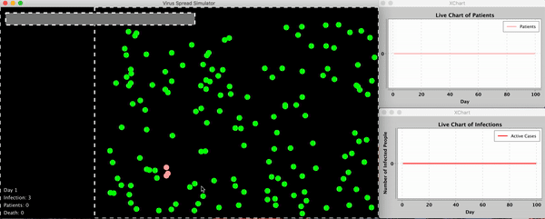
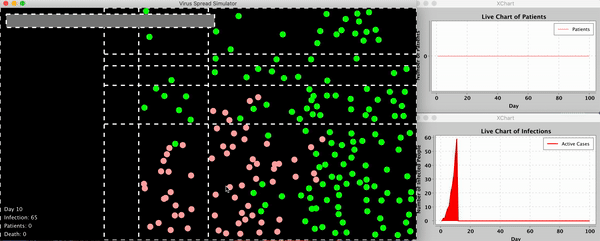

# COVID-19Simulator
## Introduction
In this project, we use the Java DrawingPanel package to simulate the spread of COVID-19 under different circumstances, such as medical conditions, social distancing, population density, etc. The purpose of this project is to show the effects of changing one or more of the factors that may potentially influence the spread of Coronavirus.

Authors: Huandong Chang, Jun Seok Choi, Mingyang Fan 

## Presentation
See Presentation.pdf for our Presentation

## Run the Code
Download the five source files and two jar files (as external libraries) in the src folder. Run VirusSpreadSimulator.java File. Detailed description is in RunCode.docx File or Code&Menu_Instructions.pdf Presentation.  

## Demos

### The first demo shows the simulation of a small population, large hospital capacity, and without quarantine.

### The second demos shows the simulation of a large population, small hospital capacity, and with quarantine.

## Functions and Features
In this simplified simulation, we assume the population is randomly located in a city and ignore all kinds of facilities except for a hospital. Features of our simulator include but are not limited to:

- Menu is designed for user to adjust variables in the simulator. See Code&Menu_Instructions.pdf or Menu Instructions.docx for detailed Manu Instruction.

- Hospital: The only facility in the city is a hospital. The hospital will continue to accept patients until they are full. Patients will be removed from the hospital once they are recovered or dead. Users can adjust the capacity of the hospital.

- Each Person has several features: age, speed, probability of being infected, recovery time after infected, and death probability.

- Each Person's Mode:
  - Healthy: Green, not infected.
  - Sick: Pink, no symptom but infectious, will not be hospitalized; 
  - Hospitalize: Red, infectious in the city and will be hospitalized if the hospital is not full.
  - Recovered: Blue, once a person is cured by the hospital. 
  - Death: Disappear, once a person is turned into Hospitalize State, this patient has a certain chance to die. 
  
- Quarantine Mode: People can choose the quarantine mode, then each person will be limited to a certain area without interacting with people in other areas. Quarantine level can be adjusted through Menu.

- Population Density: Users can adjust population (density) through Menu.

- Live Chart: User can see the live chart of the current cases of infection, the current number of patients, and the current cases of death. A CSV file including all the useful variables in this simulator will be automatically exported, and user can do further data analysis.

## Models and Calculations

#### Model

The features of this project serve the R = DOTS formula for person-to-person transmission. 

Rate of infection = Duration * Opportunity * Transmission probability * Susceptibility.

#### Data and Calculation

- Every 0.4 second represents a day.
- Population Age Distrubution: Age is uniformly distributed between 0 and 90. 
- Speed: Each person's speed is negatively correlated to their age.
- Every person has 50%-90% chance of getting infected, positively corrected to the age. Sick state will last for 14 days after infected for everyone, then turn into Hospitalize State.
- After turning into Hospitalize State, this patient will recover after 14 to 42 days, positively correlated to the age except the patient dies. Note the getting into hospital can halve the recovery time.
- Death rate for different ages
[(Estimates of the severity of coronavirus disease 2019)](https://www.thelancet.com/journals/laninf/article/PIIS1473-3099(20)30243-7/fulltext):

0-10: 0.0000161

10-20:0.0000695

20-30: 0.000309

30-40: 0.0844

40-50: 0.0016

50-60: 0.00595

60-70: 0.0193

70-80: 0.0428

80-: 0.078

## Analysis
In the attached Analysis.docx File, we compared and analyzed the effect of quarantine, the effect of population size, and the effect of hospital capacity.

## Reference
https://github.com/AzizZayed/Virus-Spread-Simulation

https://www.nytimes.com/2020/03/05/health/coronavirus-deaths-rates.html?referringSource=articleShare

https://www.thelancet.com/journals/laninf/article/PIIS1473-3099(20)30243-7/fulltext
